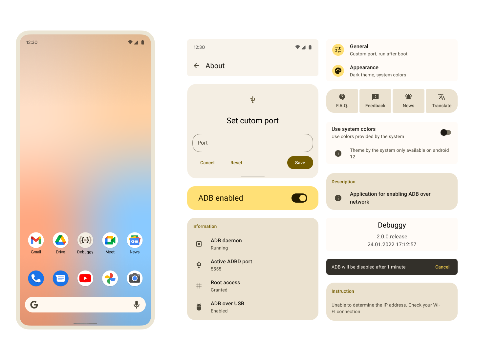

# Debuggy
Application for enable android debug bride over network with some additional features.

## Features

* Enable ADB over network with just a few clicks 
* Run ADB over network after boot device
* Custom port support
* Disable ADB after some time
* Material 3 full support

## License

    Copyright 2022 Jeffrey Turns

    Licensed under the Apache License, Version 2.0 (the "License");
    you may not use this file except in compliance with the License.
    You may obtain a copy of the License at

    http://www.apache.org/licenses/LICENSE-2.0

    Unless required by applicable law or agreed to in writing, software
    distributed under the License is distributed on an "AS IS" BASIS,
    WITHOUT WARRANTIES OR CONDITIONS OF ANY KIND, either express or implied.
    See the License for the specific language governing permissions and
    limitations under the License.
